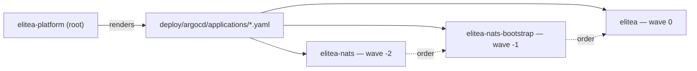

`deploy/argocd/` is the GitOps composition for the Kubernetes path: one root `Application` that renders every child `Application` under `deploy/argocd/applications/`, in sync-wave order. There is no umbrella Helm chart — an earlier one (`deploy/helm/elitea-platform/`) was scaffolded and never built, and was removed once app-of-apps replaced it.

## Apply the root once

```bash
kubectl apply -f deploy/argocd/app-of-apps.yaml
```

This is the only object you apply by hand. `kubectl apply -f deploy/argocd/` (no `-R`) reaches only this file — the children come from ArgoCD reading the directory, not from a second `kubectl apply`. The root itself is deliberately not one of the children it manages: an `Application` that enumerated itself could prune itself.



## Sync-wave order

| Application | Chart | Wave | Namespace | Why this order |
|---|---|---|---|---|
| `elitea-nats` | `deploy/helm/nats` | -2 | `elitea-gateway` | Must be healthy before its JetStream assets are created. |
| `elitea-nats-bootstrap` | `deploy/helm/nats-bootstrap` | -1 | `elitea-gateway` | Creates the KV buckets and budget-deltas stream the gateway's counters and the scheduler both dial; the hook Job is idempotent, safe on every sync. |
| `elitea` | `deploy/helm/elitea` | 0 | `elitea` | The platform release. |

Ordering **within** the `elitea` Application is Helm hook ordering, not a further sync wave — the migration Job runs `pre-install,pre-upgrade` and Helm blocks the release on it, the workload-session Job follows, and the runtime Redis consumer groups are created `post-install`. A failed migration aborts the release and the previous pods keep serving.

## Where each value comes from

`deploy/argocd/applications/elitea.yaml` states every value in one `spec.source.helm` block — nothing reaches the release from anywhere else:

<Steps>
<Step title="Chart defaults">
`valueFiles: [values.yaml]`, read from the chart's own repository path.
</Step>
<Step title="Stated parameters">
`postgresql.existingSecret` and `postgresql.key` — the one database Secret every component derives its `DATABASE_URL` from.
</Step>
<Step title="The two empty parameters you must fill in">
`llmGateway.env.GATEWAY_SELF_LLM_ORIGINS` and `llmGateway.egressPosture` ship empty in git on purpose — neither can get a safe chart default. Left empty, the chart refuses to render and the Application reports `SyncFailed` naming the field, rather than installing a gateway with a disarmed guard.
</Step>
</Steps>

Fill the two empty parameters in your own GitOps copy of the file, or imperatively:

```bash
argocd app set elitea \
  -p llmGateway.env.GATEWAY_SELF_LLM_ORIGINS=https://elitea.example.com/llm/v1 \
  -p llmGateway.egressPosture=public-unrestricted
```

<Warning>
No secret goes in a parameter. A Helm parameter renders into a ConfigMap, readable by anyone with `get` on the namespace — the database DSN and every other sensitive value are Kubernetes Secrets that `postgresql.existingSecret`, `runtime.material.secretName` and the rest only *name*.
</Warning>

## Overriding values per environment

To point an environment at a different capability set — `values-standalone.yaml` or your own file — add it to `spec.source.helm.valueFiles` in that environment's copy of `elitea.yaml`, after `values.yaml` (Helm merges files in list order, so later files win):

```yaml
spec:
  source:
    helm:
      valueFiles:
        - values.yaml
        - values-standalone.yaml
      parameters:
        - name: platform.aiProjectId
          value: "1"
```

Keep one `Application` manifest per environment (a `staging/elitea.yaml`, a `prod/elitea.yaml`, or separate branches/paths per ArgoCD `Application`'s `targetRevision`) rather than templating the Application itself — the file is already the full statement of what an environment installs.

## Image tag promotion

Every first-party image and every chart is stamped with the same release version by `.github/workflows/publish.yml`'s semantic-release run — one tag for the whole platform, because a per-component tag could only ever express a mistake. Promoting a release is changing the chart version an `Application` pulls:

```bash
argocd app set elitea --helm-set image.tag=<new-tag>
  # or, pinning the chart itself:
  # edit spec.source.targetRevision if the chart is sourced from a Git tag
```

The published chart's own `image.tag` already defaults to the chart's version — only override `image.tag` to pin an environment behind the chart's own release, or to test a release candidate.

## Rollback

ArgoCD's own history covers a `sync` gone wrong:

```bash
argocd app rollback elitea <history-id>
```

For a release-level rollback (a bad image), point the `Application` back at a previous chart version and let `selfHeal: true` reconcile it — the chart's own `pre-install,pre-upgrade` migration hook still runs on the way there, so a rollback that also needs a schema rollback is a database operation, not something this reconciliation does for you. If a CI release itself failed mid-publish, the rollback job in `publish.yml` already deleted the charts and images it had pushed, so there is nothing half-published to roll back to.

## The reference environment is a private repo

The `deploy/argocd/` and `deploy/helm/` in this repository are the **template**. The team's own reference deployment rolls from a separate, private GitOps repository that layers its own value overrides and secrets on top of what is documented here — nothing in this repository points at that environment, and nothing here assumes it exists. Copy this folder's structure into your own GitOps repository rather than looking for a fourth Application that isn't in this tree.

<Note>
`syncPolicy.automated` with `prune: true` and `selfHeal: true` is set on every Application here, including the root. Removing a file from `applications/` is a production deletion of that Application and everything it manages — review those diffs as such.
</Note>

{/* source: deploy/argocd/app-of-apps.yaml:1-51; deploy/argocd/applications/elitea.yaml:1-126; deploy/argocd/applications/nats.yaml:1-31; deploy/argocd/applications/nats-bootstrap.yaml:1-36; deploy/README.md:142-282 (composition decision, values table); deploy/README.md:389-431 (publish.yml stamping) */}
