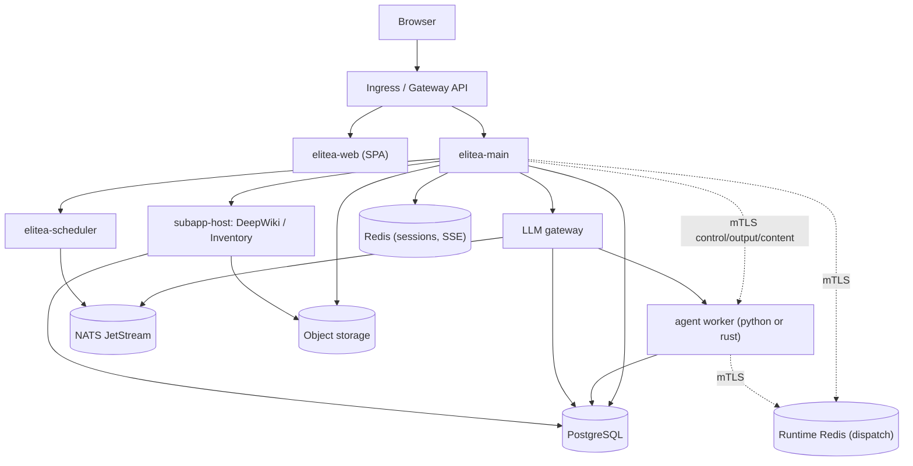

Elitea's Kubernetes path is one Helm chart, `elitea`, composed with two supporting charts (`nats`, `nats-bootstrap`) through ArgoCD's app-of-apps pattern — there is no umbrella chart. This page is the map; [Install with Helm](/deployment/helm-install) walks the install itself.

<Info title="Compose also exists">
A one-host Compose stack (`docker-compose.standalone-full.yml`) runs the same topology for evaluation and small teams — see [Install Elitea](/getting-started/install). This section covers the Kubernetes path only.
</Info>

## Target topology



Every arrow into the worker and the runtime Redis is mutually authenticated (mTLS or a TLS Redis ACL) — that plane's material is described in [Install with Helm](/deployment/helm-install#secrets-to-create-beforehand) and `deploy/runtime/README.md`. DeepWiki and Inventory are two instances of the same `subapp-host` pattern: a Go host process reaching a Python engine sidecar over a Unix socket inside one pod.

## What the chart creates, and what you bring

The chart is **one release** — elitea-main and its migration Job, elitea-web, the scheduler, the LLM gateway, the agent worker, the runtime Redis, the OTel collector, the database-preparation Job, and (opt-in) the DeepWiki and Inventory provider services with their own migration Jobs. `nats` and `nats-bootstrap` are separate charts, synced first.

<CardGroup cols={2}>
  <Card title="PostgreSQL" icon="database">No chart provisions it. Point `postgresql.existingSecret` at a Secret holding the DSN; the database may start empty (the migration Job bootstraps the schema itself), but a superuser DSN is still needed for `CREATE DATABASE` and `CREATE EXTENSION vector`.</Card>
  <Card title="Redis" icon="server">Two separate instances: a plaintext general-purpose Redis (sessions, project SSE) and, only if the runtime plane is on, a mutually authenticated TLS Redis for agent dispatch. Neither is provisioned by this chart.</Card>
  <Card title="NATS JetStream" icon="waypoints">The `nats` and `nats-bootstrap` charts ship the coordination substrate the LLM gateway's budget counters and the scheduler dial — install them, but they are commodity infrastructure this chart points at rather than owns.</Card>
  <Card title="Object storage" icon="package">An S3-compatible endpoint for artifacts and DeepWiki/Inventory output. The bucket must exist before the first sync (or set `objectInit.enabled: true` for a self-hosted S3-compatible store you administer directly); a missing bucket lets the deployment look green and then crash-loop on the next boot step.</Card>
  <Card title="Ingress" icon="route">No Ingress or HTTPRoute renders until `main.ingress.enabled` is on, and even then it is one `/` rule with elitea-main as the sole backend — see [Install with Helm](/deployment/helm-install) for the edge caveat.</Card>
  <Card title="OIDC/SAML identity provider, TLS" icon="shield-check">The chart consumes an authentication configuration document or `OIDC_ISSUER_URL`; it issues no certificates of its own beyond the in-cluster mTLS hops (cert-manager `ClusterIssuer`, brought by you).</Card>
</CardGroup>

## Sizing: the PostgreSQL connection budget

The runtime plane (agent execution) opens **six isolated connection pools per elitea-main replica** — 36 connections beyond the primary pool — and they may not share capacity. `values-standalone.yaml` sizes for this explicitly: at `postgresql.maxConnections: 200` and `main.autoscaling.maxReplicas: 4`, four replicas cost roughly 4 × 42 = 168 connections, inside the 175 left after `reservedConnections: 25` (interactive `psql`, backup tooling, the migration and `dbInit` Jobs). The chart's own guard (`elitea-main.validateConnectionBudget`) refuses to render a topology that would exceed the stated ceiling, rather than letting it surface later as `FATAL: sorry, too many clients already` on whichever component connects next.

<Warning>
A connection pooler is not a substitute for this budget today. pgbouncer in transaction mode breaks pgx's prepared-statement caching and the secrets backfill's advisory lock; session mode buys almost nothing because this platform's client pools already hold connections open for their lifetime. Size PostgreSQL for the topology instead.
</Warning>

## Published artefacts

Every chart (`elitea`, `nats`, `nats-bootstrap`) and every first-party image is built, cosign-signed (keyless) and pushed to `ghcr.io/elitea-ng` by the release job in `.github/workflows/publish.yml`, after the images they reference are already pushed and signed.

```bash
helm install elitea oci://ghcr.io/elitea-ng/charts/elitea --version <tag>
```

<Steps>
<Step title="Charts have no `latest` tag">
An OCI chart reference resolves by SemVer, so `--version <tag>` is required in practice — there is no floating tag to fall back on.
</Step>
<Step title="`image.tag` is stamped at package time">
The in-repo chart defaults to `"latest"`; the published chart's `image.tag` is rewritten to the release version so it never installs a stale cached layer.
</Step>
<Step title="Verify the signature">
```bash
cosign verify ghcr.io/elitea-ng/charts/elitea:<tag> \
  --certificate-identity-regexp '^https://github.com/elitea-ng/elitea-platform/' \
  --certificate-oidc-issuer https://token.actions.githubusercontent.com
```
Image manifests verify the same way, against `ghcr.io/elitea-ng/<component>:<tag>`.
</Step>
</Steps>

<Note>
If any part of a release fails, the rollback job deletes the pushed charts along with the images — a chart never stays published pointing at an image that got rolled back.
</Note>

Continue to [Install with Helm](/deployment/helm-install) for the step-by-step install, or [GitOps with ArgoCD](/deployment/argocd) if you are deploying through the app-of-apps.

{/* source: deploy/README.md:163-431 (chart table, composition decision, distribution); deploy/helm/elitea/values-standalone.yaml:1-20 (connection budget); deploy/helm/elitea/values.yaml:80-136 (postgresql.maxConnections, reservedConnections); deploy/helm/elitea/Chart.yaml (chart description) */}
