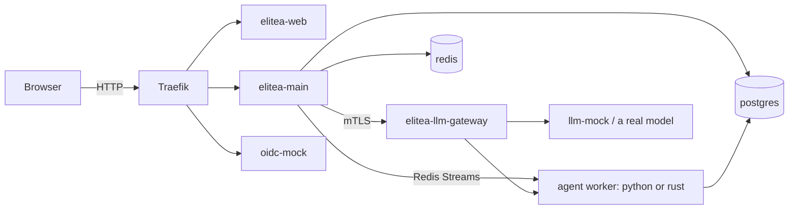

Elitea's platform code lives in one Go-and-TypeScript monorepo, with two Python and Rust services alongside it. This page covers what to install and how the repository is organized. See [Run the standalone stack](/development/standalone-stack) to bring the platform up locally, and [elitea-web development](/development/frontend) or [Backend services](/development/backend) for the day-to-day edit loop.

## Install the toolchain

<Steps>
<Step title="Containers: podman">
Install podman and its `podman compose` provider. Every compose command in this documentation set — and in the repository's own scripts — assumes podman; the `docker` CLI is not required and is not what CI uses locally either.
</Step>
<Step title="Go">
Install the Go toolchain the workspace pins (`go.work` at the repository root). `services/elitea-llm-gateway` pins its own, newer Go release and is deliberately **outside** the workspace — its `Containerfile` builds it with `GOWORK=off`, and `task test`/`task vet`/`task lint` never open it. Run its own test suite from inside `services/elitea-llm-gateway/`.
</Step>
<Step title="Node">
Install Node 24 or newer (and npm 11 or newer) for `apps/elitea-web` — the versions are enforced by the `engines` field in its `package.json`, so an older toolchain fails `npm install` before it fails anything else.
</Step>
<Step title="Python">
Install Python 3.12 for `services/elitea-worker-python` (its `pyproject.toml` pins `>=3.12,<3.13`). The worker installs with plain `pip`; there is no `uv` lockfile or workflow step in this repository.
</Step>
<Step title="Rust">
Install a Rust toolchain for `services/elitea-worker-rust` (edition 2024). `services/elitea-worker-rust/Cargo.toml` pins the minimum `rust-version`; `rustup` picks it up automatically if you run `rustup show` inside that directory.
</Step>
<Step title="kind, Helm, kubectl">
Install `kind` v0.33 or newer, `kubectl`, and Helm v3 or v4 if you plan to exercise the Kubernetes path locally — see [Run a local Kubernetes cluster](/development/kind). You will also need `python3` and `curl` on your `PATH`.
</Step>
</Steps>

<Note>
`deploy/scripts/standalone-stack.sh` and `apps/elitea-web/scripts/e2e-stack.sh` both auto-detect `podman compose` vs. `docker compose` (`apps/elitea-web/scripts/lib/compose-detect.sh`); override with `COMPOSE_BIN="docker compose"` if you genuinely have Docker installed. On this platform's own CI runners, the Docker Compose v2 plugin is what's available.
</Note>

## Repository layout

| Path | What's there |
|---|---|
| `services/` | Go services (`elitea-main`, `elitea-scheduler`, `elitea-subapp-host`), the standalone `elitea-llm-gateway`, the `elitea-deepwiki` and `elitea-inventory` providers, and the two agent workers (`elitea-worker-python`, `elitea-worker-rust`) |
| `apps/` | `elitea-web` (the current frontend, a Vite/React monorepo of its own) and `elitea-ui` (a Git submodule, the frontend `elitea-web` is replacing) |
| `libs/` | Shared code: `libs/go` (Go libraries consumed across services), `libs/proto` (versioned cross-language contracts), `libs/jsonschema`, `libs/provider` |
| `gen/` | Generated Go bindings from `libs/proto` |
| `deploy/` | Compose files, the standalone-stack and e2e-stack scripts, Helm charts, ArgoCD manifests, the kind stack, Traefik and cert-generation scripts |
| `tools/` | Repository-local CLI tooling (for example `uictl`) |
| `conformance/`, `testdata/` | Cross-language conformance fixtures and byte vectors the workers and Go services test against |

Each Go service under `services/` and each library under `libs/go/` is its own module in the root `go.work` (`elitea-llm-gateway` excepted, as above); `apps/elitea-web` and `apps/elitea-ui` are independent npm/Vite projects.

## Run the checks

The root `Taskfile.yml` wraps the checks CI runs:

```bash
task test    # go test across every workspace module (scripts/go/workspace-run.sh test)
task vet     # go vet, same aggregation
task lint    # golangci-lint, same aggregation
task build   # builds elitea-main's binaries (elitea-main, elitea-migrate, cutover-ctl, …)
```

`task test`, `task vet`, and `task lint` all run through `scripts/go/workspace-run.sh`, which iterates every module, prints a per-module result, and exits non-zero if any module failed — a bare shell loop over modules used to report only its last iteration's status, so a failing module could hide behind a later pass. Read the run's summary rather than its exit code alone: a `NOT COVERED` line names a module on disk the command did not open (this is how `elitea-llm-gateway` shows up, since it sits outside `go.work`), and a `workspace-run skip ledger` line lists every test that skipped itself and why — a suite where every test called `t.Skip` prints `ok`, identical to a suite that ran and passed.

For `apps/elitea-web`, run `npm run typecheck`, `npm run lint`, and `npm run test:unit` from inside the directory — see [elitea-web development](/development/frontend) for the fuller gate list.

## Guardrails

The repository's `AGENTS.md` sets the architectural rules for the replatform: prefer explicit constructor dependencies over service locators; add or version a cross-language contract in `libs/proto/` before depending on an unversioned map or event name; keep API errors typed, logging internal causes with trace and execution identifiers rather than returning raw errors across a trust boundary; enforce authentication, project authorization, and tenant context before mounting product, admin, or storage handlers; use Redis Streams for durable asynchronous worker commands and an authenticated mTLS HTTP/JSON API for identity, credential, catalog, and health calls — introduce gRPC only once profiling proves it is needed; treat PostgreSQL as the source of truth for execution state, with Redis as transport only; and never add credentials, private URLs, or development defaults that act as secrets. Read the full document before touching `services/elitea-main` or the runtime plane.

## One-host stack topology

The standalone compose stack is the shape every local deployment path in this section builds on:



Continue to [Run the standalone stack](/development/standalone-stack) to bring this topology up.

{/* source: go.work:1 */}
{/* source: services/elitea-llm-gateway/go.mod:3 */}
{/* source: services/elitea-llm-gateway/Containerfile (GOWORK=off build, per deploy/docker-compose.standalone-full.yml:415-420) */}
{/* source: apps/elitea-web/package.json:10-13 */}
{/* source: services/elitea-worker-python/pyproject.toml:8 */}
{/* source: services/elitea-worker-rust/Cargo.toml:1-6 */}
{/* source: deploy/kind/README.md ("kind v0.33+, kubectl, helm v3/v4, python3, curl") */}
{/* source: apps/elitea-web/scripts/lib/compose-detect.sh (referenced by e2e-stack.sh:20-21 and standalone-stack.sh:115-117) */}
{/* source: Taskfile.yml (test/vet/lint/build tasks) */}
{/* source: scripts/go/workspace-run.sh (referenced by AGENTS.md "Verification" section) */}
{/* source: AGENTS.md ("Architecture boundaries", "Working agreements") */}
