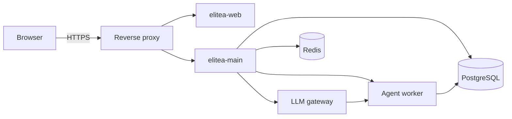

Elitea ships two deployment paths: a one-host Compose stack for evaluation and small teams, and a Helm chart for Kubernetes. Neither path bundles PostgreSQL, Redis, NATS, object storage or an ingress controller — you bring your own.

## Choose a deployment path

<Tabs>
<Tab title="Compose">

The standalone stack (`docker-compose.standalone-full.yml`) runs the whole topology — elitea-web, elitea-main, the LLM gateway, the agent worker, and supporting services — on one machine, driven by `deploy/scripts/standalone-stack.sh`:

```bash
deploy/scripts/standalone-stack.sh certs
deploy/scripts/standalone-stack.sh build
deploy/scripts/standalone-stack.sh up
```

A fresh `up` bootstraps the schema, the vector extension, the artifact bucket, RBAC roles, and the worker's runtime authorization automatically. You do not need to run any of the `seed*` subcommands — those exist only for local development and end-to-end testing.

The one setting you still set by hand is `GATEWAY_EGRESS_ALLOWLIST` on the LLM gateway service: a comma-separated `host:port` list the gateway checks a saved credential's base URL against before it will proxy to it. It defaults to the compose network's own model services. Add your own model host to it before saving a credential that points there, or the gateway refuses the connection in a way that looks like the model is down.

</Tab>
<Tab title="Kubernetes">

The Helm chart lives at `deploy/helm/elitea/`, published as a signed OCI chart. Composition is app-of-apps: an ArgoCD `Application` in `deploy/argocd/applications/` renders it, there is no separate umbrella chart.

Two values must be supplied by you — the chart refuses to render while either is empty:

- `llmGateway.env.GATEWAY_SELF_LLM_ORIGINS` — the origin the gateway advertises to itself.
- `llmGateway.egressPosture` — the gateway's default egress policy.

You also point the chart at Kubernetes Secrets you create out of band, rather than putting anything secret in a values file:

- `postgresql.existingSecret` / `postgresql.key` — the database connection string.
- `runtime.material.secretName` — the runtime's signing keys, certificates and Redis credentials (only if you enable the runtime plane, below).
- `fileConfig.authConfig.material.secretName` — the authentication plane's Redis credentials and signing keys.

Pick a values file to start from: `values.yaml` (base, minimal capabilities), `values-standalone.yaml` (the full capability set, sized for roughly 200 PostgreSQL connections across up to four replicas), `values-auth-minimal.yaml` (the cheapest install that can still seed an AI provider through the UI), or `values-staging.yaml`.

</Tab>
</Tabs>

For the full production procedure see [Install with Helm](/deployment/helm-install); for a local stack see [Run the standalone stack](/development/standalone-stack).

## Capability flags

A handful of environment variables on elitea-main turn whole capabilities on or off; each one gates a route group at startup. The values files above set sensible combinations, but if you are assembling your own:

| Flag | What it gates |
|---|---|
| `ELITEA_ARTIFACTS_ENABLED` | The Artifacts (bucket/file storage) menu and API |
| `ELITEA_CONFIGURATIONS_ENABLED` | The AI Providers configuration plane (requires authentication and a project id) |
| `ELITEA_PROJECT_INFO_ENABLED` | Project metadata endpoints |
| `ELITEA_CONFIGURATIONS_MUTATION_ENABLED` | Editing AI provider configurations (requires the configuration plane and the runtime plane) |
| `ELITEA_INDEX_TYPES_ENABLED` | Toolkit indexing |
| `ELITEA_APPLICATION_SKILLS_ENABLED` | Skills |
| `ELITEA_RUNTIME_ENABLED` | Agent execution — the chat send path itself |
| `ELITEA_INVENTORY_SOURCE_TYPES` | Which source types Inventory can ingest (defaults to GitHub and Azure DevOps Repos) |

<Note>
`ELITEA_RUNTIME_ENABLED` is the one that matters most: without it, agents cannot run at all. Turning it on is a provisioning exercise, not a flag flip — it needs a signing keyring, mutually authenticated listeners and a workload-session row, all of which the values files above provision for you.
</Note>

## First login and setup

The first account to sign in with a matching entry becomes a global administrator. Set the entry through your authentication configuration document, or through the environment variable `ELITEA_INITIAL_GLOBAL_ADMINS` (a comma-separated list) if your deployment has no such document — this is the usual path for a single-sign-on-only install.

Each entry takes one of three shapes:

| Shape | Matches |
|---|---|
| `oidc:<sub>` | The OIDC subject claim, exactly as your identity provider issues it |
| `saml:<nameid>` | The SAML NameID |
| `email:<address>` | A verified e-mail address (the login's identity token must assert `email_verified: true`) |

The variable is empty by default, so a fresh install stays unprivileged until you opt in. The grant applies once: if the account already holds an administration role you leave it as is, and an account with none receives the grant on its next sign-in.

<Steps>
<Step title="Sign in">
Open the deployment in your browser and sign in through your identity provider (or the Form plane, if configured). If your reference matches an `ELITEA_INITIAL_GLOBAL_ADMINS` entry, you land with a global administrator role.
</Step>
<Step title="Create your first project">
Open the admin console at `/admin/app/projects` and create a project. Project *creation* is administrator-only — but a member does not have to wait on you to ask: the project switcher's **+ Request a project** files a request an administrator approves or rejects from the App Requests page (see [Projects](/admin/projects)), the same way application-access requests already work.
</Step>
<Step title="Add an AI provider">
In your project, open Settings → AI Providers (`/settings/create-configuration/open_ai` for OpenAI, or pick another provider type) and save a model configuration. See [Configure an AI provider](/getting-started/configure-ai-provider) for the full field list per provider. Everything from here on — chat, agents, toolkits — is configured entirely from the UI; no direct database access is required.
</Step>
</Steps>

## After install

| Path | What's there |
|---|---|
| `/docs/` | This documentation site |
| `/api/docs` | The OpenAPI reference UI |
| `/admin/app` | The admin console |
| `/app/{projectId}/mcp/…` | Elitea's own MCP server, for external MCP clients |
| `/api/v2/scim/v2` | SCIM provisioning, if you connect an identity provider that supports it |

Observability runs over OpenTelemetry through elitea-main's collector proxy — there is no Langfuse or other third-party APM integration.


