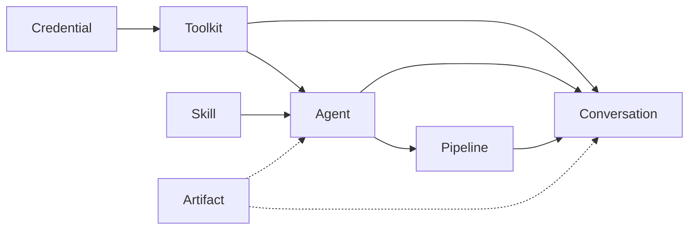

Elitea is built from a small set of concepts that combine to form larger workflows. Each one has its own menu; this page gives you the mental model before you dive in.

## Agent

An agent is a virtual assistant you configure with instructions, an AI model, and optional toolkits. It interprets a task, decides which tools to call, and acts — from searching the web to creating a Jira ticket — without you scripting every step.

A useful agent combines: clear instructions describing its job, one or more toolkits for the services it needs to reach, and a model suited to the task's complexity. See [Agents](/menus/agents).

## Skill

A skill is a reusable, Markdown-based instruction set you attach to an agent. Where an agent is a whole assistant, a skill is a focused capability — a checklist, a persona, a domain procedure — that multiple agents can share. Update the skill once and every agent that has it attached picks up the change; invoke it mid-conversation with `~skill-name`. See [Skills](/menus/skills).

## Pipeline

A pipeline is a visual, multi-step workflow that connects agents, toolkits, and control-flow nodes (decisions, routers, state updates) into a repeatable process. Use a pipeline when a task needs more than one stage — for example, reading a requirement, drafting a user story, then generating a test case — with each stage's output feeding the next. See [Pipelines](/menus/pipelines).

## Credential

A credential securely stores the authentication details — API keys, tokens, or other secrets — that a toolkit or AI provider needs to connect to an external service. Credentials are created once and can be reused across multiple toolkits and agents, and can be scoped to a project or kept private to you. See [Credentials](/menus/credentials).

## Toolkit

A toolkit is a configured integration with an external service (Jira, GitHub, Confluence, and dozens more) or an Elitea-native capability (Artifact storage, a custom OpenAPI connection). Once configured with a credential and a set of enabled tools, a toolkit can be attached to any agent, pipeline, or conversation in the project. See [Toolkits](/menus/toolkits) and the [toolkit catalogue](/reference/toolkit-catalogue).

## Conversation

A conversation is an interactive chat session where you talk to models, agents, pipelines, toolkits, MCP servers, and — in team projects — human teammates, all as participants in the same thread. Conversations keep their own history and can be organized into folders, shared, or replayed. See [Chat](/menus/chat).

## Artifact

An artifact is a file stored in a bucket that agents, pipelines, and conversations can read from and write to as shared, temporary storage. Buckets have a retention policy and are organized per project, so generated files (reports, exported data, chat attachments) have somewhere durable to live between turns. See [Artifacts](/menus/artifacts).

---

<Info title="Reference">
For definitions of additional terms, see the [Glossary](/home/glossary).
</Info>
