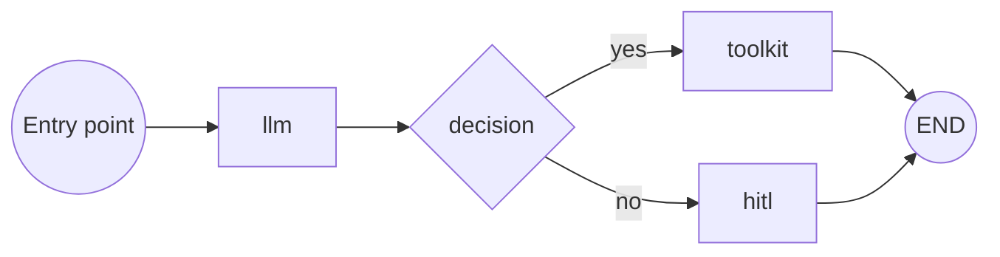

A pipeline is a visual workflow: a sequence of connected nodes that execute in order, carrying a shared state between them. Where an agent has a single conversational loop, a pipeline lets you compose multiple steps — calling a toolkit, asking an LLM, branching on a decision, pausing for human approval — into one repeatable process.

## How a pipeline runs

1. Execution starts at the pipeline's designated entry point.
2. Each node performs its action and writes results into the pipeline's shared state.
3. The pipeline follows the connection from the current node to the next, based on the node's own routing (a plain edge, or a decision/router node's branch).
4. Execution ends when a transition reaches `END`.

## What a pipeline can use

The flow editor's Add-node menu only offers node types the runtime actually executes. **Nine node types are admitted**: `decision`, `agent`, `toolkit`, `mcp`, `hitl`, `llm`, `printer`, `router`, `state_modifier`. Six older types — `tool`, `pipeline`, `function`, `loop`, `loop_from_tool`, `condition` — are deprecated: they still render if an older pipeline already contains them, but you cannot add new ones, and they carry a "Deprecated" badge in the editor. See [Pipeline node types](/how-tos/pipelines/nodes/overview) for the full comparison, and [Pipeline structure](/how-tos/pipelines/structure) for entry points, state and connections.

For the full reference table, see [Pipeline node reference](/reference/pipeline-node-reference).

## When to use a pipeline instead of an agent

Reach for a pipeline when you need a defined, repeatable sequence of steps — gather input, call a toolkit, branch on the result, get human approval, produce an output — rather than an open-ended conversation. Use an agent when the interaction should stay conversational and let the model decide what to do next. The two compose: a pipeline can include an `agent` node, and an agent can be attached to a chat conversation the same way a pipeline can.

<Screenshot id="pipeline-flow-overview" alt="Pipeline flow editor showing entry point and connected nodes" />

## Guides and references

- [Use the flow editor](/how-tos/pipelines/flow-editor)
- [Pipeline structure: entry point, states and connections](/how-tos/pipelines/structure)
- [Pipeline node types](/how-tos/pipelines/nodes/overview)
- [View pipeline runs](/how-tos/pipelines/pipeline-runs)
