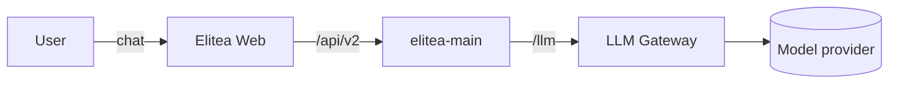

Elitea is a workspace for building and running AI agents, pipelines, and
chat-based assistants on top of your own data and tools.

This is a placeholder page: it exercises the docs SPA's navigation, search,
and component contract while the content team ports the real guide pages
over from the previous documentation site. Every component below is here so
its rendering can be checked, not because a welcome page needs all of them.

<Info>
This site describes the current Elitea platform. If a page here disagrees
with what you see in the app, the app is right — file it so the page gets
fixed.
</Info>

## Where to start

<CardGroup cols={2}>
  <Card title="Quick start" icon="rocket" href="/quick-start">
    Sign in, find your personal project, and send your first chat message.
  </Card>
  <Card title="Chat basics" icon="message-square" href="/chat-basics">
    How conversations, messages, and context work in the chat view.
  </Card>
  <Card title="Toolkits overview" icon="puzzle" href="/toolkits-overview">
    Connect external tools and services an agent can call.
  </Card>
  <Card title="Elitea on GitHub" icon="git-branch" href="https://github.com">
    The platform's source, issue tracker, and release history.
  </Card>
</CardGroup>

## How the pieces fit together

<Tip>
Use the search box in the top bar (or press `/`) to jump straight to a page
instead of browsing the left nav.
</Tip>

<Accordion title="Is this the same product as the old docs site?">
Yes — this site replaces it. The old site described an earlier version of
the platform and is being retired page by page as each topic is rewritten
against the current app.
</Accordion>
