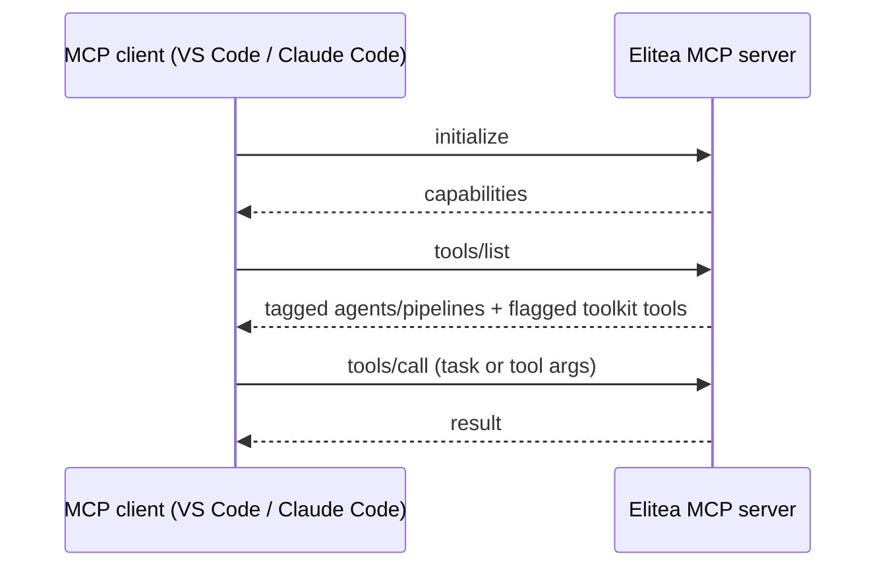

Elitea is itself an MCP server: any client that speaks the Model Context Protocol can call your tagged agents, pipelines and toolkit tools as MCP tools. The transport is streamable HTTP — a single `POST` endpoint that answers `initialize`, `tools/list` and `tools/call`. There is no SSE stream and no stdio server: a `GET` on the endpoint answers "The server does not offer an SSE stream at this endpoint."

## Prerequisites

- Your project's MCP endpoint: `https://<your-elitea-host>/app/<projectID>/mcp`.
- A [personal access token](/getting-started/create-personal-access-token), sent as `Authorization: Bearer <token>`. The server authenticates every request as that token's owner and scopes results to projects they belong to.
- At least one agent or pipeline tagged `mcp`, or a toolkit with tools marked "available by MCP" (see [Make tools available by MCP](/integrations/mcp/make-tools-available-by-mcp)) — otherwise `tools/list` returns an empty, but correct, list.

## Tag an agent or pipeline for MCP

<Steps>
<Step title="Open the agent or pipeline">
Open the agent or pipeline you want to expose.
</Step>
<Step title="Add the mcp tag">
Add the tag `mcp` to it. Elitea exposes one tool per tagged agent/pipeline, taking a single free-form `task` string as input.
</Step>
<Step title="Pick which version is served">
If the agent has several tagged versions, the newest tagged one is the one served — not necessarily the version marked "latest" in the UI. Retag or delete older tagged versions if you need a specific one served.
</Step>
</Steps>

## Connect a client

<Tabs>
<Tab title="VS Code">
Add a server entry to `.vscode/mcp.json` (workspace) or your user `mcp.json` (global):

```json
{
  "servers": {
    "elitea": {
      "type": "http",
      "url": "https://<your-elitea-host>/app/<projectID>/mcp",
      "headers": { "Authorization": "Bearer <your-token>" }
    }
  }
}
```

Reload the MCP server list, then select tools from your Elitea project in Copilot Chat's Agent mode.
</Tab>
<Tab title="Claude Code">
```bash
claude mcp add --transport http elitea \
  https://<your-elitea-host>/app/<projectID>/mcp \
  --header "Authorization: Bearer <your-token>"
```
</Tab>
</Tabs>

<Screenshot id="mcp-server-token" alt="Personal access tokens page for creating an MCP client token" />



## Common issues

<Note>
Calling a toolkit tool through this MCP server needs the Python worker's toolkit dispatch — Helm and compose both default to the Python worker (#865/#866), and on a deployment that opts into the Rust worker instead, a toolkit tool call answers a protocol error instead of a result. Agent and pipeline tools tagged `mcp` run the same way on either worker.
</Note>

<Note>
Two agents that sanitize to the same tool name collapse into one entry in `tools/list` — whichever the database returns first wins, silently. Give MCP-tagged agents and pipelines unique names.
</Note>

<Note>
A client that opens a GET (SSE) connection to the endpoint gets a 405, not a stream. If your client only supports the older SSE transport, it can't connect here — use a client that speaks streamable HTTP.
</Note>
