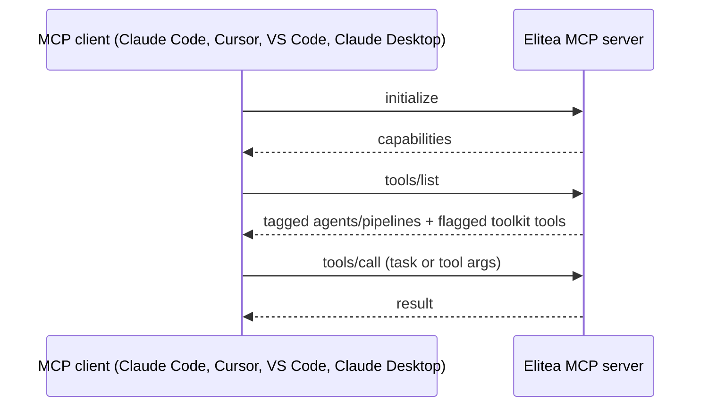

Elitea is itself an MCP server: any client that speaks the Model Context Protocol can call your tagged agents, pipelines and toolkit tools as MCP tools. The transport is streamable HTTP — a single `POST` endpoint that answers `initialize`, `tools/list` and `tools/call`. There is no SSE stream and no stdio server: a `GET` on the endpoint answers "The server does not offer an SSE stream at this endpoint."

## Prerequisites

- Your project's MCP endpoint: `https://<your-elitea-host>/app/<projectID>/mcp`. Find the project ID in the project switcher or in the address bar of the app.
- A personal access token. Send it as `Authorization: Bearer <token>`. See [Create a token](#create-a-token).
- Membership in the project. The server authenticates every request as the token owner. A token owner who is not a member of `<projectID>` gets `403 forbidden`.
- At least one agent or pipeline tagged `mcp`, or a toolkit with tools marked "available by MCP" (see [Make tools available by MCP](/integrations/mcp/make-tools-available-by-mcp)). Otherwise `tools/list` returns an empty list. An empty list is a correct answer.
- MCP exposure on the deployment. An administrator can turn it off. Then every request gets `403` with "MCP exposure is disabled on this deployment".

## Create a token

<Steps>
<Step title="Open Personal tokens">
Go to **Settings → Personal tokens** (`/settings/tokens`).
</Step>
<Step title="Generate the token">
Click **+**. Give the token a name, for example `mcp-claude-code`. Set an expiration date. Click **Generate**.
</Step>
<Step title="Copy the token">
Copy the value immediately. The dialog shows it only once. For more detail, see [Create a personal access token](/getting-started/create-personal-access-token).
</Step>
</Steps>

<Warning>
The token gives the same access as your account. Do not commit a client configuration file that contains the token. Use one token for each client, so that you can revoke one client without the others.
</Warning>

## Tag an agent or pipeline for MCP

<Steps>
<Step title="Open the agent or pipeline">
Open the agent or pipeline you want to expose.
</Step>
<Step title="Add the mcp tag">
Add the tag `mcp` to it. Elitea exposes one tool per tagged agent/pipeline, taking a single free-form `task` string as input.
</Step>
<Step title="Pick which version is served">
If the agent has several tagged versions, the newest tagged one is the one served — not necessarily the version marked "latest" in the UI. Retag or delete older tagged versions if you need a specific one served.
</Step>
</Steps>

## Connect a client

The server speaks the streamable HTTP transport only. Every client below sends `POST` requests to the endpoint with a static `Authorization` header.

<Tabs>
<Tab title="Claude Code">
Run this command once:

```bash
claude mcp add --transport http elitea \
  https://<your-elitea-host>/app/<projectID>/mcp \
  --header "Authorization: Bearer <your-token>"
```

Add `--scope user` to make the server available in all your projects. Run `claude mcp list` to make sure that the server connects. In a session, type `/mcp` to see the Elitea tools.
</Tab>
<Tab title="Cursor">
Add a server entry to `.cursor/mcp.json` (project) or `~/.cursor/mcp.json` (global):

```json
{
  "mcpServers": {
    "elitea": {
      "type": "http",
      "url": "https://<your-elitea-host>/app/<projectID>/mcp",
      "headers": { "Authorization": "Bearer <your-token>" }
    }
  }
}
```

Open **Cursor Settings → MCP** and make sure that the `elitea` server shows a green status and its tools.
</Tab>
<Tab title="VS Code">
Add a server entry to `.vscode/mcp.json` (workspace) or your user `mcp.json` (global):

```json
{
  "servers": {
    "elitea": {
      "type": "http",
      "url": "https://<your-elitea-host>/app/<projectID>/mcp",
      "headers": { "Authorization": "Bearer <your-token>" }
    }
  }
}
```

Reload the MCP server list. Then select tools from your Elitea project in Copilot Chat's Agent mode.
</Tab>
<Tab title="Claude Desktop">
Claude Desktop custom connectors do not send a static `Authorization` header. Use the [`mcp-remote`](https://www.npmjs.com/package/mcp-remote) bridge. The bridge runs locally, adds the header, and forwards each request to Elitea. It needs Node.js 18 or later.

Open **Settings → Developer → Edit Config**. Add this entry to `claude_desktop_config.json`:

```json
{
  "mcpServers": {
    "elitea": {
      "command": "npx",
      "args": [
        "-y",
        "mcp-remote",
        "https://<your-elitea-host>/app/<projectID>/mcp",
        "--transport",
        "http-only",
        "--header",
        "Authorization:${ELITEA_AUTH}"
      ],
      "env": { "ELITEA_AUTH": "Bearer <your-token>" }
    }
  }
}
```

Restart Claude Desktop. The header value is in `env` because some platforms split an argument that contains a space. `--transport http-only` stops the bridge from a retry with the older SSE transport, which this server does not support.
</Tab>
</Tabs>

<Screenshot id="mcp-server-token" alt="Personal access tokens page for creating an MCP client token" />


```mermaid
sequenceDiagram
    participant Client as MCP client (Claude Code, Cursor, VS Code, Claude Desktop)
    participant Elitea as Elitea MCP server
    Client->>Elitea: initialize
    Elitea-->>Client: capabilities
    Client->>Elitea: tools/list
    Elitea-->>Client: tagged agents/pipelines + flagged toolkit tools
    Client->>Elitea: tools/call (task or tool args)
    Elitea-->>Client: result
```

## Common issues

<Note>
Calling a toolkit tool through this MCP server needs the Python worker's toolkit dispatch — Helm and compose both default to the Python worker (#865/#866), and on a deployment that opts into the Rust worker instead, a toolkit tool call answers a protocol error instead of a result. Agent and pipeline tools tagged `mcp` run the same way on either worker.
</Note>

<Note>
Two agents that sanitize to the same tool name collapse into one entry in `tools/list` — whichever the database returns first wins, silently. Give MCP-tagged agents and pipelines unique names.
</Note>

<Note>
The endpoint accepts `POST` only. A client that opens a `GET` (SSE) connection gets `405` with "The server does not offer an SSE stream at this endpoint". A client that supports only the older SSE transport cannot connect. Use a client that speaks streamable HTTP.
</Note>

| Response | Cause | Action |
| --- | --- | --- |
| `401 unauthorized` | The token is missing, expired or revoked. | Create a new token and update the client configuration. |
| `403 forbidden` | The token owner is not a member of the project. | Ask a project administrator to add you, or use a project ID that you are a member of. |
| `403` "MCP exposure is disabled on this deployment" | An administrator turned off MCP exposure. | Ask the administrator to turn it on. |
| `405` "The server does not offer an SSE stream at this endpoint" | The client sent `GET` to open an SSE stream. | Configure the client for the HTTP transport, not SSE. |
| Empty `tools/list` | No agent or pipeline has the `mcp` tag, and no toolkit tool is available by MCP. | Add the `mcp` tag, as in [Tag an agent or pipeline for MCP](#tag-an-agent-or-pipeline-for-mcp). |
