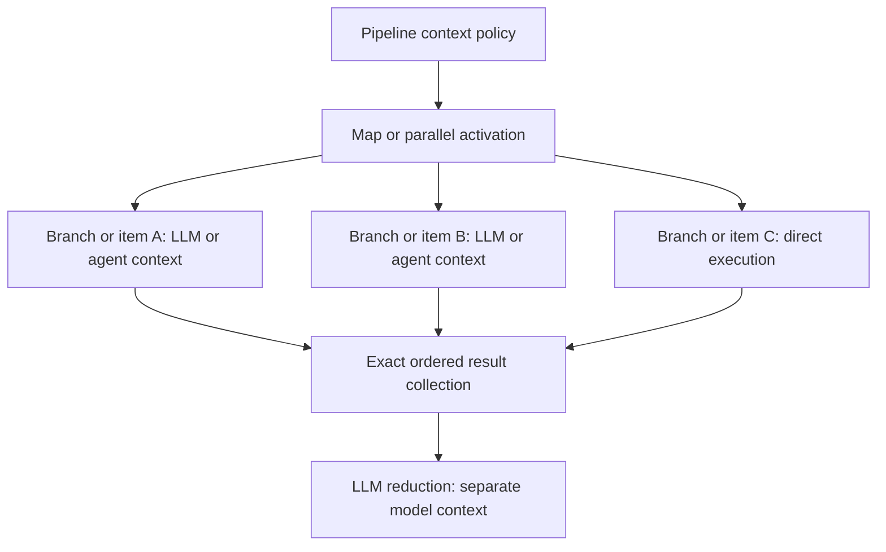

# Context compaction and continuation

Status: implementation requirements; completion is not yet proved.

## Required continuation state

Compaction must leave enough information to continue the actual job.
Store a versioned checkpoint through the existing durable session and checkpoint infrastructure.
Do not add a table solely for a summary.

Keep these components distinct:

- Authoritative project context and skill content, with source IDs, revisions, scope, and activation state.
- Original user request and subsequent user instructions, linked to their immutable conversation events.
- Current objective, constraints, decisions, completed work, unfinished work, and the next action.
- Tool calls, results, artifact references, approvals, interrupts, and resume identities from durable execution records.
- A generated structured continuation record of older conversation content, explicitly marked as derived information.

A summary must not replace authoritative instructions or invent successful work.
Completed operations must reference actual tool outcomes or durable receipts.
Pending and ambiguous operations remain pending until their state is reconciled.
Keep full conversation history available for retrieval and audit.

The [ordinary root implementation](source-mapping/durable-context-compaction.md) now validates a structured continuation record.
It separates completed work, evidence references, open work, next steps, decisions, constraints, and unresolved issues.
Format and reference checks do not prove semantic completeness; live-model quality acceptance remains required.
Original events stay stored while the next model request uses a compact projection.

## Token budget

User steering on 2026-09-14 asks for a simple default and full-model option. The implementation plan uses two presets:

- Balanced: a default total budget of 272,000 tokens, capped by the model's supported context window.
- Full: the model's supported total context window.

User clarification on 2026-09-17 replaces legacy numeric context settings with Balanced or Full.
Do not reinterpret a historical 64,000-token value as the combined window.
Keep model output caps separate. Read old records without migrating or rewriting them.
Already admitted execution inputs retain their frozen policy during continuation.
Store new selections in the existing context-strategy metadata if that contract can express them.
Main resolves provider limits from the authorized model catalogue and freezes the admitted limits for Rust.
Do not infer a model's capacity from its name or add its advertised input and output maxima together.
Keep a provider's separate input-only maximum distinct from its combined context-window maximum.

Reserve the invocation's admitted maximum output, including reasoning where the provider charges it to that limit.
When the user has not selected a smaller output cap, the model's supported maximum is the reservation.
Output capacity is inside the selected context budget, not additional to it.
For a hypothetical 400,000-token combined window and 64,000 output reservation, input can use at most 336,000 tokens before margin.
For a 1,000,000-token combined window and 128,000 output reservation, Full allows at most 872,000 input tokens before margin.
Balanced with that same output reservation allows at most 144,000 input tokens before margin.
If authoritative model limits are unavailable, disclose the configured fallback; do not label it Full capacity.

The context indicator reports current estimated input, output reservation, margin, total budget, and remaining input capacity.
Replace estimates with provider measurements where available and keep their provenance explicit.
Compaction frees current-request space; it does not reset cumulative usage or billing.
Changing the model or output cap recomputes the available input budget.

Make the decision before each model call, including calls within a tool loop.
Budget the final request after instruction rehydration and tool-schema assembly.
Include system instructions, active context and skills, user input, history, tool schemas, tool results, and provider framing.
Reserve the configured next-response output allowance and a bounded estimation margin.

The admission condition is:

`estimated full input + reserved output + margin <= effective context window`

Use provider token counts when available and a conservative estimator before submission.
Report estimated and measured values separately.
Track cumulative input and output usage separately from the per-request context window.
Repeated input tokens increase cost but do not accumulate into the next request's context window automatically.

An output cap limits one response. It does not implement context compaction.
When protected content alone exceeds the available input budget, return an explicit bounded failure.
Do not silently discard instructions or send an already known oversized request.

The summary call has a separate bounded output allowance; a short chat reply cap must not truncate continuation notes.
The current same-model adapter reserves up to 8,192 tokens, capped by the frozen catalogue output maximum.
It recomputes summary input capacity and leaves chat controls unchanged.
A different summary model must receive its own authorized binding and frozen limits before selection is enabled.
The [dedicated model component](source-mapping/dedicated-summary-model.md) now supplies that binding through protobuf field 66.
Main now resolves stored settings and restores admitted policies for continuation. Deployed selection and browser acceptance remain open.
The snapshot carries no credentials, tools, or task instructions.

## Child agents and pipeline model requests

User clarification on 2026-09-16 applies independent compaction to nested agents and applications.
Each child inherits the parent's admitted context policy, including the preset, explicit limit, preservation rules, and compaction thresholds.
Freeze that policy for the child invocation and retain it during recovery.
The default trigger calculation uses 90 percent of usable input capacity, with a target of 70 percent after compaction.
Automatic triggering and durable model projection have component checks. Deployed settings and browser acceptance remain open.
The target does not authorize dropping protected content; the complete request must still pass its final capacity check.

Each child measures its own complete model request and retains its own summary and source coverage.
It does not inherit the parent's occupancy, summary, or private transcript automatically.
Explicit task and history mappings still determine the child's input.
Parent compaction must not change a child's checkpoint; child compaction must not change its parent or siblings.
The returned child result counts toward the parent's next request when that request includes it.
Aggregate execution usage and concurrency limits remain separate controls.

Inherit the policy, then recompute capacity against the child's authorized model and admitted output cap.
A Balanced child has at most 272,000 total tokens, even when its model supports a larger window.
A smaller child model lowers that total; a different output cap changes its usable input and trigger.
Inherit Full as a preset, not as the parent's resolved token count.
Any inherited summary-model selection still requires authorization and its own request limits.

A pipeline has durable graph state, but it does not necessarily have a model conversation.
The pipeline container has no separate compaction setting.
Pass an inherited agent or chat policy through the graph when one exists.
Without an inherited policy, a saved child uses its explicit context setting or defaults to Balanced.
Plain LLM nodes also compact their own accumulated model history, as confirmed by the user on 2026-09-16.
They use the inherited policy when available and otherwise default to Balanced.
No new per-node compaction control is required for this default.
Do not summarize the entire graph checkpoint or replace its state variables with a narrative summary.

| Execution kind | Context behavior |
| --- | --- |
| Nested agent or application | Use an independent compaction scope with inherited policy and child-specific model limits. |
| Pipeline LLM node | Budget each complete request. Compact eligible mapped history and completed local tool exchanges before each model call. |
| Model-backed decision node | Apply the same request budget. Preserve exact routing instructions, declared choices, and required data. |
| Direct tool, code, or deterministic map/reduce step | Do not invoke a summarizer. Preserve exact state and use the node's existing resource limits. |
| Map branch or reducer that invokes a model | Apply the policy to that model request or nested agent. Keep branch and iteration scopes separate. |

Mixed pipelines and pipelines containing only LLM nodes follow the same model-invocation rule.
Budget only the graph values actually included in a request, together with its instructions, history, tools, and framing.
Keep current mapped task data exact; compact only content admitted as summarizable history.
If required data alone exceeds capacity, return a clear failure rather than silently changing its meaning.
Explicit chunking, reduction, and authored summary nodes retain separate graph semantics.

Store model-history summaries with execution, child path, node invocation, and source-coverage identity through existing checkpoint infrastructure.
Reuse a summary only when its scope and covered source events still match.
A loop visit or map item must not reuse another invocation's summary merely because the node name matches.
Persist this state before relying on it, and restore the same scope after worker replacement.
Keep original graph data and conversation events available for replay and audit.

### Fan-out and model-backed reduction

Map and parallel containers can own work that invokes LLMs, agents, or nested pipelines.
Their scheduling and collection operations do not define a shared model context window.
Each descendant model conversation owns its occupancy and summaries under the inherited policy.

Use the existing child lineage for compaction ownership.
Map identity includes activation, source digest, item ordinal, item digest, and worker definition.
Parallel identity includes activation, branch identity, ordinal, mapped input, and worker definition.
The descendant model scope also identifies its node invocation and covered source history.
Persist summary state under that lineage, without introducing a second scheduler or identity system.

A semantic reduce step is an explicit LLM or agent operation with its own request budget.
The mechanical `append`, `sum`, and `merge` reducers keep their deterministic contracts.
Compaction must not silently convert mechanical collection into semantic reduction.

Branch context windows do not add together into the reduce model's capacity.
Eight branch outputs of 32,000 tokens produce about 256,000 input tokens before instructions and provider framing.
They cannot fit a Balanced reduce request with a 128,000-token output reservation and 141,280 usable input tokens.
Compacting branch histories does not reduce those already returned output values.
Use an explicit bounded chunk/reduce graph or artifact references when the authored workflow requires larger inputs.
Persist intermediate reduce outputs so replacement does not repeat completed model work.
Do not silently omit items, truncate structured results, or invoke hidden summarizers to make the join fit.

Show context pressure for the active model scope in runtime status.
Container progress reports branch outcomes; aggregate token usage reports execution cost.
Neither value represents one pipeline-wide context occupancy.
Keep inherited settings as the default without requiring authors to configure every node separately.
When a pipeline starts without an inherited policy, apply the child-setting and Balanced fallback rules above.

## Compaction sequence

1. Load authoritative instructions and the latest valid continuation checkpoint.
2. Reconcile tool outcomes and pending resume state against durable records.
3. Estimate the complete next request and reserve output tokens.
4. Compact only eligible older content, preserving complete tool call/result groups.
5. Validate the checkpoint's source coverage, bounds, and instruction references.
6. Persist the checkpoint before relying on it for another model call.
7. Rehydrate authoritative instructions and rebuild the request from the checkpoint and retained recent events.
8. Recheck the complete request budget before sending it.

Unresolved tool calls and authorization interrupts must not be summarized into successful outcomes.
Concurrent workers must use existing generation and claim fencing for checkpoint updates.
A replacement worker must load the same authoritative state without the original process or its memory.

## Existing source and ADK ownership

The installed dependency is ADK-Rust 2.2.0.
`adk-runner::compaction` supplies compaction strategies and event-token estimation.
`adk-runner::IntraInvocationCompactor` supplies per-call-cycle triggering and summarizer integration.
Its default trigger estimates event content and can fall back to uncompacted history after summary failure.
That default does not establish the full-request budget or durable checkpoint requirements above.
The 2.2.0 Runner calls `maybe_compact` before `agent.run`; it does not call it inside every `LlmAgent` model iteration.
The `LlmAgent` before-model callback does execute each iteration, after tool declarations and request contents are assembled.
Apply the final request check there, after instruction rehydration, with durable persistence before dispatch.
The provider adapters also inject the bound agent's static system instructions outside `LlmRequest.contents`.
Include that content and provider framing in the full-input estimate; counting only the callback's contents is insufficient.
Checkpoint ordering must preserve the prepared dynamic instructions and compacted request before the provider call.

`adk-agent::LlmEventSummarizer` supplies the existing model-backed summarization primitive.
Its formatter reads only text parts. Normalize complete tool call/result groups into an explicit transcript for summarization.
Preserve tool identities and success, error, pending, and ambiguous outcomes; never omit them because they are structured parts.
ADK `EventsCompactionConfig` also supports invocation intervals, retained overlap, and a configurable summarizer.
The Runner persists the summarizer event through `SessionService::append_event_for_identity`.
ADK `EventCompaction` stores the covered timestamps and compacted content.
The Runner history projection uses this boundary without deleting the original stored events.
Elitea's `RunnerSessionService` forwards these events to the existing durable session service.
Use this path for durable summaries before considering a custom persistence mechanism.
Verify replacement-worker replay and summary bounds before enabling it.

Use these primitives with Elitea-owned authority, request budgeting, and failure handling.
Do not copy another framework's runtime or replace the current language-neutral contracts.

The legacy Rust `src/agents/context_management.rs` strategy compacts only the invocation's event view.
Old bindings without frozen limits retain that path.
Ordinary roots with an admitted summary plan and frozen limits now use `src/agents/context_compaction.rs`.
That path persists exact source coverage and the prepared request through the existing model checkpoint writer.
Ordinary child agents now use independent model sessions through `src/agents/model_scope.rs`.
These sessions inherit policy, preserve original events, and share the root execution's claim fence.
Summary reload does not authorize a parent tool retry.
Pipeline LLM and model-backed Decision nodes now use scoped callbacks with stable graph-step and parent-call identities.
Mixed-graph component tests preserve exact state and deterministic output; model-free graphs make no summary call.
Nested and graph-model recovery coordination, direct root HITL resume, and deployed settings delivery remain open.
`src/agents/instruction_authority.rs` already provides separate versioned instruction state and rehydration.
Complete integration with that state rather than asking a summary model to recreate instructions.
Main now resolves context policies for Start and Regenerate, and restores admitted policies for Continue.
See [settings delivery](source-mapping/context-policy-delivery.md). Deployment, UI controls, and browser acceptance remain open.
Complete authorized settings and model-limit delivery before claiming that UI compaction controls affect this worker.

The [model budget foundation](source-mapping/model-context-budget.md) now freezes catalogue limits in the input contract.
Both provider adapters check their completed request against input capacity after output reservation and margin.
This final check prevents oversized dispatch when compaction is absent or insufficient.
It does not replace the before-model compaction callback or durable summary persistence.
Main still needs to deliver resolved user and conversation settings before the UI can control that policy.

## Point 4 baseline verification, 2026-09-14

The existing Rust context-management suite passes 21 tests with no ignored cases.
Those tests prove the existing history-only behavior, not this design's complete request budget or durable summary requirements.
The current SDK now uses a low-tier summary model and LangChain summarization/context-editing middleware through `runtime/clients/client.py`.
Use that implementation as functional evidence for model choice and controls, without copying its fallback behavior or storage design.

## Required proof

Test combined input/output boundaries and large tool schemas.
Verify compaction during a long tool loop without separating calls from results.
Verify original user intent and later corrections survive repeated compactions.
Verify skill and project-context revisions remain exact after source edits.
Verify completed work remains completed and ambiguous effects are not retried automatically.
Verify inherited policies with different child models and output caps, without sharing parent or sibling occupancy.
Verify child compaction and recovery leave parent and sibling checkpoints unchanged.
Verify graphs without model calls perform no summarization.
Verify mixed graphs preserve exact state while model requests compact only eligible history.
Verify loops and concurrent branches cannot reuse summaries from a different invocation or source history.
Restart the worker after checkpoint persistence and resume through the UI.
Confirm the next action uses the retained objective, instructions, artifacts, and pending execution state.
Keep the gate open until these tests and the deployed continuation proof pass.
